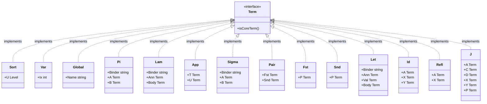

# HoTT Kernel Architecture Diagrams

This document provides visual representations of the HypergraphGo HoTT (Homotopy Type Theory) kernel architecture, data flow, and key algorithms.

---

## MASTER DIAGRAM: Complete HoTT Kernel Architecture

```mermaid
%%{init: {'themeVariables': { 'fontSize': '14px'}}}%%
flowchart LR
    %% ═══════════════════════════════════════════════════════════════════════════
    %% LEFT COLUMN: INPUT + KERNEL LAYER
    %% ═══════════════════════════════════════════════════════════════════════════

    subgraph COL1[" "]
        direction TB

        subgraph INPUT["⬇ INPUT"]
            direction LR
            I1["ast.Term"]
            I2["ctx.Ctx"]
            I3["GlobalEnv"]
        end

        subgraph KERNEL["⚙ KERNEL LAYER"]
            direction TB

            subgraph CHECK["kernel/check"]
                direction TB
                C1["Checker"]
                C2["Synth · Check · CheckIsType"]
                C3["GlobalEnv · Inductive · Recursor"]
                C4["Positivity · Errors · Span"]
            end

            subgraph CTX["kernel/ctx"]
                direction LR
                X1["Ctx{Tele}"]
                X2["Extend · Lookup · Drop"]
            end

            subgraph SUBST["kernel/subst"]
                direction LR
                S1["Shift · Subst"]
                S2["IShift · ISubst"]
            end
        end

        subgraph OUTPUT["⬆ OUTPUT"]
            direction LR
            O1["Type"]
            O2["Error"]
            O3["Normal Form"]
        end
    end

    %% ═══════════════════════════════════════════════════════════════════════════
    %% CENTER COLUMN: AST TERMS
    %% ═══════════════════════════════════════════════════════════════════════════

    subgraph COL2[" "]
        direction TB

        subgraph AST["📦 internal/ast"]
            direction TB

            subgraph CORE_TERMS["Core Terms"]
                direction LR
                subgraph ATOMIC["Atomic"]
                    T01["Sort{U}"]
                    T02["Var{Ix}"]
                    T03["Global{Name}"]
                end
                subgraph FUNCS["Π Types"]
                    T04["Pi{A,B}"]
                    T05["Lam{Body}"]
                    T06["App{T,U}"]
                end
                subgraph PRODS["Σ Types"]
                    T07["Sigma{A,B}"]
                    T08["Pair{Fst,Snd}"]
                    T09["Fst · Snd"]
                end
            end

            subgraph IDENT["Identity Types"]
                direction LR
                T10["Id{A,X,Y}"]
                T11["Refl{A,X}"]
                T12["J{A,C,D,X,Y,P}"]
                T13["Let{Val,Body}"]
            end

            subgraph CUBICAL_TERMS["Cubical Terms"]
                direction LR

                subgraph INTERVAL["Interval"]
                    T14["I · I0 · I1"]
                    T15["IVar{Ix}"]
                end

                subgraph PATHS["Paths"]
                    T16["Path{A,X,Y}"]
                    T17["PathP{A,X,Y}"]
                    T18["PathLam{Body}"]
                    T19["PathApp{P,R}"]
                    T20["Transport{A,E}"]
                end

                subgraph FACES["Faces"]
                    T21["⊤ · ⊥"]
                    T22["FaceEq{i=0/1}"]
                    T23["∧ · ∨"]
                end

                subgraph PARTIAL["Partial"]
                    T24["Partial{Φ,A}"]
                    T25["System{Branches}"]
                end

                subgraph COMP["Composition"]
                    T26["Comp{A,Φ,u,a₀}"]
                    T27["HComp{A,Φ,u,a₀}"]
                    T28["Fill{A,Φ,u,a₀}"]
                end

                subgraph GLUE["Glue Types"]
                    T29["Glue{A,Sys}"]
                    T30["GlueElem"]
                    T31["Unglue"]
                end

                subgraph UA["Univalence"]
                    T32["UA{A,B,e}"]
                    T33["UABeta{e,a}"]
                end
            end
        end
    end

    %% ═══════════════════════════════════════════════════════════════════════════
    %% RIGHT COLUMN: EVALUATION + VALUES
    %% ═══════════════════════════════════════════════════════════════════════════

    subgraph COL3[" "]
        direction TB

        subgraph EVAL["⚡ internal/eval"]
            direction TB

            subgraph NBE["NbE Pipeline"]
                direction LR
                E1["Eval(env,term)"]
                E2["Apply(f,arg)"]
                E3["Reify(value)"]
            end

            subgraph CUBICAL_EVAL["Cubical Evaluation"]
                direction LR
                E4["EvalCubical"]
                E5["PathApply"]
                E6["EvalTransport"]
                E7["EvalComp · EvalHComp"]
                E8["EvalGlue · EvalUnglue"]
                E9["UAPathApply"]
            end

            subgraph RECURSOR["Recursor Engine"]
                direction LR
                R1["RecursorRegistry"]
                R2["tryGenericReduction"]
                R3["buildIH"]
            end
        end

        subgraph VALUES["📊 Semantic Domain"]
            direction TB

            subgraph CORE_VALUES["Core Values"]
                direction LR
                V01["VSort{Level}"]
                V02["VLam{Closure}"]
                V03["VPi{A,B}"]
                V04["VSigma{A,B}"]
                V05["VPair{Fst,Snd}"]
                V06["VNeutral{N}"]
                V07["VId · VRefl"]
            end

            subgraph CUBICAL_VALUES["Cubical Values"]
                direction LR

                subgraph IVAL["Interval"]
                    V08["VI0 · VI1"]
                    V09["VIVar{Level}"]
                end

                subgraph PVAL["Paths"]
                    V10["VPath{A,X,Y}"]
                    V11["VPathP{A,X,Y}"]
                    V12["VPathLam{IClosure}"]
                    V13["VTransport{A,E}"]
                end

                subgraph FVAL["Faces"]
                    V14["VFaceTop · VFaceBot"]
                    V15["VFaceEq{ILevel,IsOne}"]
                    V16["VFaceAnd · VFaceOr"]
                end

                subgraph CVAL["Composition"]
                    V17["VPartial · VSystem"]
                    V18["VComp · VHComp"]
                    V19["VFill"]
                end

                subgraph GVAL["Glue"]
                    V20["VGlue{A,System}"]
                    V21["VGlueElem"]
                    V22["VUnglue"]
                end

                subgraph UVAL["Univalence"]
                    V23["VUA{A,B,Equiv}"]
                    V24["VUABeta{Equiv,Arg}"]
                end
            end

            subgraph STRUCTURES["Supporting Structures"]
                direction LR
                ST1["Env{Bindings}"]
                ST2["Closure{Env,Term}"]
                ST3["IClosure{Env,IEnv,Term}"]
                ST4["IEnv{Bindings}"]
                ST5["Neutral{Head,Spine}"]
            end
        end

        subgraph CONV["🔄 internal/core"]
            direction LR
            CV1["Conv(t,u)"]
            CV2["AlphaEq"]
            CV3["alphaEqExtension"]
        end
    end

    %% ═══════════════════════════════════════════════════════════════════════════
    %% CONNECTIONS
    %% ═══════════════════════════════════════════════════════════════════════════

    INPUT --> CHECK
    CHECK --> OUTPUT
    CHECK --> CTX
    CHECK --> SUBST
    CHECK --> CONV
    CHECK --> EVAL

    AST --> CHECK
    AST --> EVAL
    AST --> CONV

    EVAL --> VALUES
    VALUES --> CONV

    NBE --> CORE_VALUES
    CUBICAL_EVAL --> CUBICAL_VALUES

    %% ═══════════════════════════════════════════════════════════════════════════
    %% STYLING - No background fills, only stroke colors
    %% ═══════════════════════════════════════════════════════════════════════════

    style COL1 fill:none,stroke:none
    style COL2 fill:none,stroke:none
    style COL3 fill:none,stroke:none

    style INPUT stroke:#666,stroke-width:2px
    style OUTPUT stroke:#666,stroke-width:2px

    style KERNEL stroke:#888,stroke-width:2px
    style CHECK stroke:#888
    style CTX stroke:#888
    style SUBST stroke:#888

    style AST stroke:#888,stroke-width:2px
    style CORE_TERMS stroke:#666
    style ATOMIC stroke:#666
    style FUNCS stroke:#666
    style PRODS stroke:#666
    style IDENT stroke:#666

    %% Cubical components - green stroke
    style CUBICAL_TERMS stroke:#2da44e,stroke-width:2px
    style INTERVAL stroke:#2da44e
    style PATHS stroke:#2da44e
    style FACES stroke:#2da44e
    style PARTIAL stroke:#2da44e
    style COMP stroke:#2da44e
    style GLUE stroke:#2da44e
    style UA stroke:#2da44e

    style EVAL stroke:#888,stroke-width:2px
    style NBE stroke:#666
    style CUBICAL_EVAL stroke:#2da44e,stroke-width:2px
    style RECURSOR stroke:#666

    style VALUES stroke:#888,stroke-width:2px
    style CORE_VALUES stroke:#666
    style CUBICAL_VALUES stroke:#2da44e,stroke-width:2px
    style IVAL stroke:#2da44e
    style PVAL stroke:#2da44e
    style FVAL stroke:#2da44e
    style CVAL stroke:#2da44e
    style GVAL stroke:#2da44e
    style UVAL stroke:#2da44e
    style STRUCTURES stroke:#666

    style CONV stroke:#888,stroke-width:2px
```



---

## MASTER DIAGRAM: Detailed Component Architecture

```mermaid
flowchart TB
    subgraph LAYER1["INPUT LAYER"]
        direction LR
        IN1["Source Term<br/>ast.Term"]
        IN2["Typing Context<br/>ctx.Ctx"]
        IN3["Global Environment<br/>GlobalEnv"]
    end

    subgraph LAYER2["KERNEL LAYER"]
        direction LR

        subgraph CHECKER["kernel/check"]
            direction TB
            CHK1["Checker API"]
            CHK2["Synth() · Check()"]
            CHK3["CheckIsType()"]

            subgraph BIDIR["Bidirectional Rules"]
                direction TB
                BD1["synthVar · synthSort · synthGlobal"]
                BD2["synthPi · synthLam · synthApp"]
                BD3["synthSigma · synthFst · synthSnd"]
                BD4["synthId · synthRefl · synthJ"]
            end

            subgraph BIDIR_CUB["Cubical Rules"]
                direction TB
                BC1["synthPath · synthPathP"]
                BC2["synthPathLam · synthPathApp"]
                BC3["synthTransport"]
                BC4["synthComp · synthHComp · synthFill"]
                BC5["synthGlue · synthUA · synthUABeta"]
                BC6["checkSystemAgreement"]
                BC7["faceIsBot · isContradictoryFaceAnd"]
            end

            subgraph ENV["Environment"]
                direction TB
                EN1["Axiom · Definition"]
                EN2["Inductive · Primitive"]
                EN3["Constructor · Eliminator"]
            end

            subgraph RECUR["Recursor Generation"]
                direction TB
                RG1["GenerateRecursorType"]
                RG2["buildMotiveType"]
                RG3["buildCaseType"]
            end

            subgraph POS["Positivity Checking"]
                direction TB
                PS1["CheckPositivity"]
                PS2["checkArgTypePositivity"]
                PS3["occursIn"]
            end
        end

        subgraph CONTEXT["kernel/ctx"]
            direction TB
            CTX1["Ctx{Tele: []Binding}"]
            CTX2["Extend(name, type)"]
            CTX3["LookupVar(ix) → Term"]
            CTX4["Drop() · Len()"]
        end

        subgraph SUBSTITUTION["kernel/subst"]
            direction TB
            SUB1["Shift(d, c, term)"]
            SUB2["Subst(ix, repl, term)"]
            SUB3["IShift(d, c, term)"]
            SUB4["ISubst(ix, r, term)"]
            SUB5["ISubstFace → simplify"]
        end
    end

    subgraph LAYER3["INTERNAL LAYER"]
        direction LR

        subgraph CORE["internal/core"]
            direction TB
            CR1["Conv(env, t, u, opts)"]
            CR2["AlphaEq(a, b)"]
            CR3["alphaEqExtension<br/>(cubical terms)"]
            CR4["alphaEqFace<br/>(face formulas)"]
            CR5["etaEqual(a, b)"]
            CR6["shiftTerm"]
        end

        subgraph EVALUATION["internal/eval"]
            direction TB

            subgraph NBE_CORE["NbE Core"]
                NB1["EvalNBE(term)"]
                NB2["Eval(env, term)"]
                NB3["Reify(value)"]
                NB4["reifyAt(level, v)"]
            end

            subgraph NBE_CUB["Cubical NbE"]
                NC1["EvalCubical(env, ienv, term)"]
                NC2["ReifyCubicalAt(level, ilevel, v)"]
                NC3["PathApply(p, r)"]
                NC4["EvalTransport(A, e)"]
                NC5["EvalComp · EvalHComp · EvalFill"]
                NC6["EvalGlue · EvalGlueElem · EvalUnglue"]
                NC7["EvalUA · EvalUABeta · UAPathApply"]
                NC8["evalFace · simplifyFaceAnd/Or"]
            end

            subgraph APPLY["Application"]
                AP1["Apply(fun, arg)"]
                AP2["β-reduce: VLam"]
                AP3["extend spine: VNeutral"]
            end

            subgraph PROJ["Projections"]
                PJ1["Fst(pair)"]
                PJ2["Snd(pair)"]
                PJ3["VPair → component"]
                PJ4["VNeutral → extend"]
            end

            subgraph JELIM["J Elimination"]
                JE1["evalJ(a,c,d,x,y,p)"]
                JE2["p = VRefl → d"]
                JE3["else → VNeutral"]
            end

            subgraph REC_ENGINE["Recursor Engine"]
                RE1["RecursorRegistry"]
                RE2["RegisterRecursor"]
                RE3["tryGenericRecursorReduction"]
                RE4["buildRecursorCall"]
            end
        end

        subgraph SYNTAX["internal/ast"]
            direction TB

            subgraph TERM_CORE["Core Terms"]
                TC1["Sort{U Level}"]
                TC2["Var{Ix int}"]
                TC3["Global{Name string}"]
                TC4["Pi{Binder, A, B}"]
                TC5["Lam{Binder, Ann, Body}"]
                TC6["App{T, U}"]
                TC7["Sigma{Binder, A, B}"]
                TC8["Pair{Fst, Snd}"]
                TC9["Fst{P} · Snd{P}"]
                TC10["Let{Binder, Ann, Val, Body}"]
                TC11["Id{A, X, Y}"]
                TC12["Refl{A, X}"]
                TC13["J{A, C, D, X, Y, P}"]
            end

            subgraph TERM_CUB["Cubical Terms"]
                TB1["Interval · I0 · I1 · IVar"]
                TB2["Path{A,X,Y} · PathP{A,X,Y}"]
                TB3["PathLam{Body} · PathApp{P,R}"]
                TB4["Transport{A, E}"]
                TB5["FaceTop · FaceBot · FaceEq · FaceAnd · FaceOr"]
                TB6["Partial{Φ,A} · System{Branches}"]
                TB7["Comp · HComp · Fill"]
                TB8["Glue · GlueElem · Unglue"]
                TB9["UA{A,B,Equiv} · UABeta{Equiv,Arg}"]
            end

            subgraph PRINT["Printing"]
                PR1["Sprint(term)"]
                PR2["write(buf, term)"]
            end
        end
    end

    subgraph LAYER4["SEMANTIC DOMAIN"]
        direction LR

        subgraph VALUES_CORE["Core Values"]
            VC1["VSort{Level int}"]
            VC2["VGlobal{Name string}"]
            VC3["VLam{Body *Closure}"]
            VC4["VPi{A Value, B *Closure}"]
            VC5["VSigma{A Value, B *Closure}"]
            VC6["VPair{Fst, Snd Value}"]
            VC7["VNeutral{N Neutral}"]
            VC8["VId{A, X, Y Value}"]
            VC9["VRefl{A, X Value}"]
        end

        subgraph VALUES_CUB["Cubical Values"]
            VB1["VI0 · VI1 · VIVar{Level}"]
            VB2["VPath{A,X,Y} · VPathP{A,X,Y}"]
            VB3["VPathLam{Body *IClosure}"]
            VB4["VTransport{A *IClosure, E Value}"]
            VB5["VFaceTop · VFaceBot · VFaceEq · VFaceAnd · VFaceOr"]
            VB6["VPartial · VSystem{Branches}"]
            VB7["VComp · VHComp · VFill"]
            VB8["VGlue · VGlueElem · VUnglue"]
            VB9["VUA{A,B,Equiv} · VUABeta{Equiv,Arg}"]
        end

        subgraph STRUCTURES["Structures"]
            ST1["Env{Bindings []Value}"]
            ST2["Closure{*Env, ast.Term}"]
            ST3["IClosure{*Env, *IEnv, ast.Term}"]
            ST4["IEnv{Bindings []Value}"]
            ST5["Neutral{Head, Sp []Value}"]
            ST6["Head{Var int, Glob string}"]
        end
    end

    subgraph LAYER5["OUTPUT LAYER"]
        direction LR
        OUT1["Inferred Type"]
        OUT2["Type Error"]
        OUT3["Normal Form"]
    end

    %% CONNECTIONS
    LAYER1 --> CHECKER
    CHECKER --> LAYER5

    CHECKER --> CONTEXT
    CHECKER --> SUBSTITUTION
    CHECKER --> CORE
    CHECKER --> EVALUATION

    SYNTAX --> CHECKER
    SYNTAX --> EVALUATION
    SYNTAX --> CORE

    EVALUATION --> VALUES_CORE
    EVALUATION --> VALUES_CUB
    NBE_CUB --> VALUES_CUB

    CORE --> EVALUATION

    %% STYLING - No background fills, only stroke colors
    style LAYER1 stroke:#888,stroke-width:2px
    style LAYER2 stroke:#888,stroke-width:2px
    style LAYER3 stroke:#888,stroke-width:2px
    style LAYER4 stroke:#888,stroke-width:2px
    style LAYER5 stroke:#888,stroke-width:2px

    style CHECKER stroke:#666
    style CONTEXT stroke:#666
    style SUBSTITUTION stroke:#666
    style CORE stroke:#666
    style EVALUATION stroke:#666
    style SYNTAX stroke:#666

    style BIDIR stroke:#666
    style BIDIR_CUB stroke:#2da44e,stroke-width:2px
    style ENV stroke:#666
    style RECUR stroke:#666
    style POS stroke:#666

    style NBE_CORE stroke:#666
    style NBE_CUB stroke:#2da44e,stroke-width:2px
    style APPLY stroke:#666
    style PROJ stroke:#666
    style JELIM stroke:#666
    style REC_ENGINE stroke:#666

    style TERM_CORE stroke:#666
    style TERM_CUB stroke:#2da44e,stroke-width:2px
    style PRINT stroke:#666

    style VALUES_CORE stroke:#666
    style VALUES_CUB stroke:#2da44e,stroke-width:2px
    style STRUCTURES stroke:#666
```



---

## Type System Summary


---

## Computation Rules

```mermaid
flowchart TB
    subgraph BETA["β-Reduction"]
        B1["(λx.t) u → t[u/x]"]
        B2["fst (a,b) → a"]
        B3["snd (a,b) → b"]
        B4["J A C d x x refl → d"]
    end

    subgraph PATH_COMP["Path Computation"]
        P1["⟨i⟩t @ i0 → t[i0/i]"]
        P2["⟨i⟩t @ i1 → t[i1/i]"]
        P3["transport A e → e<br/>(when A constant)"]
    end

    subgraph COMP_RULES["Composition Rules"]
        C1["comp A [⊤ ↦ u] a₀ → u[i1/i]"]
        C2["comp A [⊥ ↦ _] a₀ → transport A a₀"]
        C3["hcomp A [⊤ ↦ u] a₀ → u[i1/i]"]
        C4["hcomp A [⊥ ↦ _] a₀ → a₀"]
    end

    subgraph GLUE_RULES["Glue Computation"]
        G1["Glue A [⊤ ↦ (T,e)] = T"]
        G2["glue [⊤ ↦ t] a = t"]
        G3["unglue (glue [φ↦t] a) = a"]
    end

    subgraph UA_RULES["Univalence Computation"]
        U1["(ua e) @ i0 = A"]
        U2["(ua e) @ i1 = B"]
        U3["(ua e) @ i = Glue B [(i=0)↦(A,e)]"]
        U4["transport (ua e) a = e.fst a"]
    end

    subgraph FACE_SIMP["Face Simplification"]
        F1["(i=0) ∧ (i=1) → ⊥"]
        F2["(i=0) ∨ (i=1) → ⊤"]
        F3["⊤ ∧ φ → φ"]
        F4["⊥ ∨ φ → φ"]
    end

    style BETA stroke:#666,stroke-width:2px
    style PATH_COMP stroke:#2da44e,stroke-width:2px
    style COMP_RULES stroke:#2da44e,stroke-width:2px
    style GLUE_RULES stroke:#2da44e,stroke-width:2px
    style UA_RULES stroke:#2da44e,stroke-width:2px
    style FACE_SIMP stroke:#2da44e,stroke-width:2px
```



---

## Table of Contents

1. [Package Architecture](#1-package-architecture)
2. [Term Type Hierarchy](#2-term-type-hierarchy)
3. [Value Type Hierarchy (NbE)](#3-value-type-hierarchy-nbe)
4. [Bidirectional Type Checking Flow](#4-bidirectional-type-checking-flow)
5. [Normalization by Evaluation (NbE) Pipeline](#5-normalization-by-evaluation-nbe-pipeline)
6. [Eval Function Flow](#6-eval-function-flow)
7. [Apply Function (Beta Reduction)](#7-apply-function-beta-reduction)
8. [Reify Function Flow](#8-reify-function-flow)
9. [J Elimination (Path Induction)](#9-j-elimination-path-induction)
10. [Conversion Checking](#10-conversion-checking)
11. [Context and Environment Management](#11-context-and-environment-management)
12. [Complete Type Checking Pipeline](#12-complete-type-checking-pipeline)

---

## 1. Package Architecture


### Package Dependencies (Detailed)


---

## 2. Term Type Hierarchy



### Term Categories

```mermaid
flowchart TB
    subgraph Atomic["Atomic Terms"]
        Sort["Sort<br/>Universe Levels"]
        Var["Var<br/>De Bruijn Index"]
        Global["Global<br/>Named Constants"]
    end

    subgraph Function["Function Types (Π)"]
        Pi["Pi<br/>(x:A) → B"]
        Lam["Lam<br/>λx. body"]
        App["App<br/>f u"]
    end

    subgraph Product["Product Types (Σ)"]
        Sigma["Sigma<br/>Σ(x:A). B"]
        Pair["Pair<br/>(a, b)"]
        Fst["Fst<br/>π₁"]
        Snd["Snd<br/>π₂"]
    end

    subgraph Identity["Identity Types (Id)"]
        Id["Id<br/>Id A x y"]
        Refl["Refl<br/>refl A x"]
        J["J<br/>Path Induction"]
    end

    subgraph Control["Control Flow"]
        Let["Let<br/>let x = v in e"]
    end

    Pi --> Lam
    Lam --> App
    Sigma --> Pair
    Pair --> Fst
    Pair --> Snd
    Id --> Refl
    Refl --> J

    style Atomic stroke:#666
    style Function stroke:#666
    style Product stroke:#666
    style Identity stroke:#666
    style Control stroke:#666
```



---

## 3. Value Type Hierarchy (NbE)


---

## 4. Bidirectional Type Checking Flow


---

## 5. Normalization by Evaluation (NbE) Pipeline


### NbE Complete Pipeline


---

## 6. Eval Function Flow


---

## 7. Apply Function (Beta Reduction)


### Beta Reduction Example


---

## 8. Reify Function Flow


### Reify Neutral Terms


---

## 9. J Elimination (Path Induction)

```mermaid
flowchart TB
    Start([evalJ a c d x y p]) --> CheckProof{p is VRefl?}

    CheckProof -->|Yes| ComputationRule
    CheckProof -->|No| StuckNeutral

    subgraph ComputationRule["Computation Rule Applies"]
        CR1["J A C d x x (refl A x) → d"]
        CR2["return d"]
        CR1 --> CR2
    end

    subgraph StuckNeutral["Stuck - Return Neutral"]
        SN1["head := Head{Glob: 'J'}"]
        SN2["spine := [a, c, d, x, y, p]"]
        SN3["VNeutral{N: Neutral{Head: head, Sp: spine}}"]
        SN1 --> SN2 --> SN3
    end

    ComputationRule --> Result([Value])
    StuckNeutral --> Result

    style ComputationRule stroke:#666
    style StuckNeutral stroke:#666
```



### J Typing Rules


---

## 10. Conversion Checking


### Alpha Equality

```mermaid
flowchart TB
    Start([AlphaEq a b]) --> NilCheck{both nil?}
    NilCheck -->|Yes| ReturnTrue([true])
    NilCheck -->|No| OneNil{one nil?}
    OneNil -->|Yes| ReturnFalse([false])
    OneNil -->|No| TypeMatch

    TypeMatch{Same Type?}
    TypeMatch -->|No| ReturnFalse
    TypeMatch -->|Yes| Compare

    subgraph Compare["Structural Comparison"]
        C1["Sort: a.U == b.U"]
        C2["Var: a.Ix == b.Ix"]
        C3["Global: a.Name == b.Name"]
        C4["Pi: AlphaEq(A) && AlphaEq(B)"]
        C5["Lam: AlphaEq(Body)"]
        C6["App: AlphaEq(T) && AlphaEq(U)"]
        C7["Sigma: AlphaEq(A) && AlphaEq(B)"]
        C8["Pair: AlphaEq(Fst) && AlphaEq(Snd)"]
        C9["Id: AlphaEq(A,X,Y)"]
        C10["Refl: AlphaEq(A,X)"]
        C11["J: AlphaEq(A,C,D,X,Y,P)"]
    end

    Compare --> Result([bool])

    style Compare stroke:#666
```

---

## 11. Context and Environment Management

### Typing Context (kernel/ctx)

```mermaid
flowchart LR
    subgraph Ctx["Ctx Structure"]
        Tele["Tele: []Binding"]
    end

    subgraph Operations["Context Operations"]
        Extend["Extend(name, type)<br/>Add binding at front"]
        Lookup["LookupVar(ix)<br/>Get type by index"]
        Drop["Drop()<br/>Remove newest"]
        Len["Len()<br/>Number of bindings"]
    end

    Ctx --> Operations

    style Ctx stroke:#888,stroke-width:2px
    style Operations stroke:#666
```

### De Bruijn Environment (internal/eval)

```mermaid
flowchart TB
    subgraph Env["Env Structure"]
        Bindings["Bindings: []Value"]
    end

    subgraph EnvOps["Environment Operations"]
        direction LR
        Extend["Extend(v)<br/>Prepend value"]
        Lookup["Lookup(ix)<br/>Get by index"]
    end

    subgraph Example["Example: [A, B, C]"]
        E0["Index 0 → A (newest)"]
        E1["Index 1 → B"]
        E2["Index 2 → C (oldest)"]

        After["After Extend(D):<br/>[D, A, B, C]"]

        E0 --> After
    end

    Env --> EnvOps
    EnvOps --> Example

    style Env stroke:#888,stroke-width:2px
    style EnvOps stroke:#666
    style Example stroke:#666
```

### Global Environment (kernel/check)

```mermaid
classDiagram
    class GlobalEnv {
        -axioms map[string]*Axiom
        -defs map[string]*Definition
        -inductives map[string]*Inductive
        -primitives map[string]*Primitive
        -order []string
        +NewGlobalEnv() *GlobalEnv
        +NewGlobalEnvWithPrimitives() *GlobalEnv
        +AddAxiom(name, type)
        +AddDefinition(name, type, body, trans)
        +AddInductive(name, type, constrs, elim)
        +LookupType(name) Term
        +LookupDefinitionBody(name) Term, bool
        +Has(name) bool
    }

    class Axiom {
        +Name string
        +Type Term
    }

    class Definition {
        +Name string
        +Type Term
        +Body Term
        +Transparency Transparency
    }

    class Inductive {
        +Name string
        +Type Term
        +Constructors []Constructor
        +Eliminator string
    }

    class Primitive {
        +Name string
        +Type Term
    }

    GlobalEnv --> Axiom
    GlobalEnv --> Definition
    GlobalEnv --> Inductive
    GlobalEnv --> Primitive
```

---

## 12. Complete Type Checking Pipeline

```mermaid
flowchart TB
    subgraph Input["Input"]
        Term["ast.Term"]
        Ctx["Typing Context"]
        Globals["Global Environment"]
    end

    subgraph TypeChecker["Type Checker (kernel/check)"]
        Checker["Checker"]
        Synth["synth()"]
        Check["check()"]

        Checker --> Synth
        Checker --> Check
    end

    subgraph Helpers["Helper Operations"]
        CheckIsType["checkIsType()"]
        EnsurePi["ensurePi()"]
        EnsureSigma["ensureSigma()"]
        EnsureSort["ensureSort()"]
        WHNF["whnf() → EvalNBE"]
    end

    subgraph CoreOps["Core Operations"]
        Conv["conv() → core.Conv()"]
        Subst["subst.Subst()"]
        Shift["subst.Shift()"]
    end

    subgraph NbE["NbE Engine"]
        Eval["eval.Eval()"]
        Apply["eval.Apply()"]
        Reify["eval.Reify()"]
        EvalJ["eval.evalJ()"]
    end

    subgraph Output["Output"]
        Type["Inferred Type"]
        Error["TypeError"]
    end

    Term --> Checker
    Ctx --> Checker
    Globals --> Checker

    TypeChecker --> Helpers
    TypeChecker --> CoreOps

    Helpers --> WHNF
    WHNF --> NbE
    CoreOps --> NbE

    TypeChecker --> Type
    TypeChecker --> Error

    style Input stroke:#888,stroke-width:2px
    style TypeChecker stroke:#888,stroke-width:2px
    style NbE stroke:#666
    style Helpers stroke:#666
    style CoreOps stroke:#666
    style Output stroke:#888,stroke-width:2px
```

### Complete Example: Type Checking Identity Function

```mermaid
sequenceDiagram
    participant User
    participant Checker
    participant Synth
    participant CheckIsType
    participant Subst
    participant Conv
    participant NbE

    Note over User: λ(A:Type0). λ(x:A). x
    User->>Checker: Synth(ctx, term)

    Checker->>Synth: synth(ctx, Lam A:Type0. ...)
    Synth->>CheckIsType: checkIsType(ctx, Type0)
    CheckIsType->>NbE: whnf(Type0)
    NbE-->>CheckIsType: Sort{1}
    CheckIsType-->>Synth: level 0 ✓

    Note over Synth: Extend ctx with A:Type0
    Synth->>Synth: synth(ctx+A, Lam x:A. x)
    Synth->>CheckIsType: checkIsType(ctx+A, A)
    CheckIsType->>NbE: whnf(A)
    NbE-->>CheckIsType: Sort{0}
    CheckIsType-->>Synth: level 0 ✓

    Note over Synth: Extend ctx with x:A
    Synth->>Synth: synth(ctx+A+x, x)
    Note over Synth: Var lookup: x → A (shifted)
    Synth->>Subst: Shift(2, 0, A)
    Subst-->>Synth: A (at correct index)

    Synth-->>Synth: Pi{x, A, A}
    Synth-->>Synth: Pi{A, Type0, Pi{x, A, A}}
    Synth-->>Checker: Π(A:Type0). Π(x:A). A
    Checker-->>User: Type inferred ✓
```

---

## Summary

This document provides a comprehensive visual guide to the HoTT kernel architecture:

1. **Package Structure**: Clear separation between kernel (trusted), internal (implementation), and command layers
2. **Term Hierarchy**: 14 term constructors covering dependent types, pairs, and identity types
3. **Value Hierarchy**: 9 value types for the NbE semantic domain
4. **Bidirectional Type Checking**: Synth/Check modes with case analysis for each term type
5. **NbE Pipeline**: Eval → Apply → Reify for normalization
6. **J Elimination**: Path induction with computation rule for reflexivity
7. **Conversion**: Definitional equality via normalization and structural comparison
8. **Context Management**: De Bruijn indices with proper shifting and substitution

The kernel implements a sound intensional type theory with identity types (Id, refl, J), supporting the foundations for homotopy type theory.
