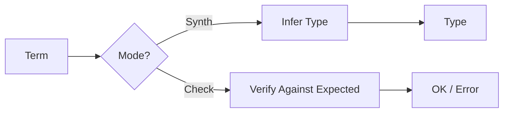

# Architecture

The HoTTGo kernel follows strict design principles to maintain soundness and clarity.

---

## Overview


*For detailed Mermaid diagrams, see [DIAGRAMS.md](https://github.com/watchthelight/HypergraphGo/blob/main/DIAGRAMS.md).*

---

## Package Structure

```
├── cmd/
│   ├── hg/           # Hypergraph CLI
│   └── hottgo/       # HoTT CLI
├── kernel/           # Trusted core (minimal, panic-free)
│   ├── check/        # Bidirectional type checker
│   ├── ctx/          # Typing context
│   └── subst/        # Substitution operations
├── internal/         # Implementation details
│   ├── ast/          # Core AST terms
│   ├── eval/         # NbE evaluation
│   ├── core/         # Conversion checking
│   └── parser/       # S-expression parser
└── hypergraph/       # Generic hypergraph library
```

---

## Design Principles

### Kernel Boundary

The kernel (`kernel/`) is the trusted core:

- **Minimal** — only essential operations
- **Total** — all functions terminate
- **Panic-free** — returns typed errors

Everything outside the kernel (parsing, elaboration, tactics) is untrusted and re-checked.

### De Bruijn Indices

Core terms use de Bruijn indices for variable binding:

- No name capture issues
- Straightforward substitution
- Surface syntax keeps user names for display

### NbE Conversion

Definitional equality via Normalization by Evaluation:

1. **Eval** — syntax → semantic values
2. **Apply** — handle application (beta reduction)
3. **Reify** — semantic values → normal form
4. **Compare** — structural equality on normal forms

Optional η-rules for Π and Σ types behind feature flags.

### Strict Positivity

All inductive definitions are checked for strict positivity to ensure consistency.

---

## Type Checking Flow



Bidirectional type checking with:

- **Synthesis** — infer type from term structure
- **Checking** — verify term against expected type

---

## Further Reading

- [DESIGN.md](https://github.com/watchthelight/HypergraphGo/blob/main/DESIGN.md) — design decisions and invariants
- [DIAGRAMS.md](https://github.com/watchthelight/HypergraphGo/blob/main/DIAGRAMS.md) — comprehensive Mermaid diagrams
- [docs/rules/](rules/id.md) — typing rules documentation
