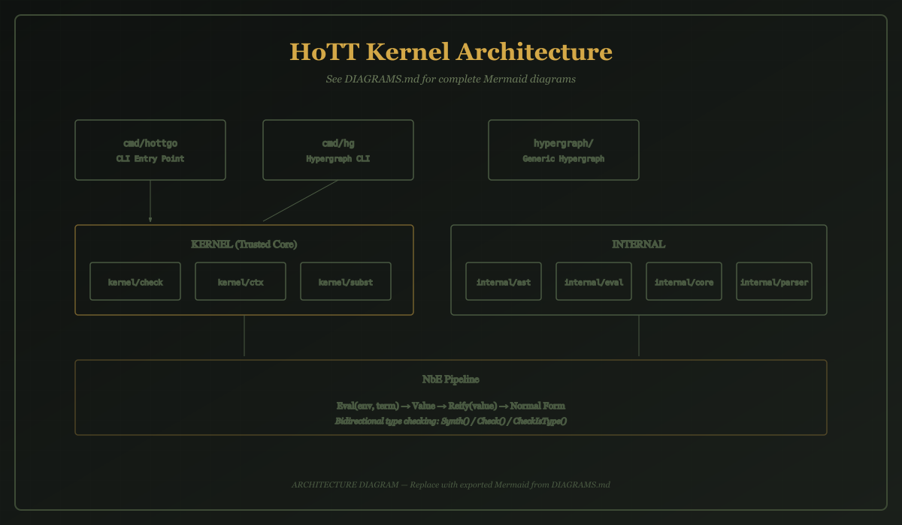
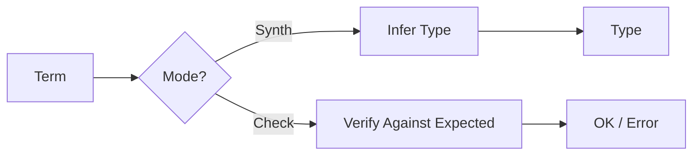

# HypergraphGo Architecture

This document provides a comprehensive overview of the HypergraphGo architecture,
covering package dependencies, data flow, design decisions, and extension points.

---

## Overview



*For detailed Mermaid diagrams, see [DIAGRAMS.md](https://github.com/watchthelight/HypergraphGo/blob/main/DIAGRAMS.md).*

---

## Package Dependency Diagram

```
                         ┌─────────────────────────────────────────────────┐
                         │                    cmd/                         │
                         │    ┌──────────┐           ┌──────────┐          │
                         │    │   hg/    │           │ hottgo/  │          │
                         │    └────┬─────┘           └────┬─────┘          │
                         └─────────┼──────────────────────┼────────────────┘
                                   │                      │
              ┌────────────────────┼──────────────────────┤
              │                    │                      │
              ▼                    │                      ▼
    ┌─────────────────┐            │            ┌─────────────────────────┐
    │   hypergraph/   │            │            │        kernel/          │
    │                 │            │            │  ┌─────────────────┐    │
    │  Hypergraph[V]  │            │            │  │     check/      │    │
    │  Algorithms     │            │            │  │  Type Checker   │────┼───┐
    │  Transforms     │            │            │  └────────┬────────┘    │   │
    └─────────────────┘            │            │           │             │   │
                                   │            │  ┌────────┴────────┐    │   │
                                   │            │  │      ctx/       │    │   │
                                   │            │  │ Typing Context  │    │   │
                                   │            │  └─────────────────┘    │   │
                                   │            │                         │   │
                                   │            │  ┌─────────────────┐    │   │
                                   │            │  │     subst/      │    │   │
                                   │            │  │  Substitution   │    │   │
                                   │            │  └─────────────────┘    │   │
                                   │            └─────────────────────────┘   │
                                   │                                          │
                                   ▼                                          │
                         ┌─────────────────────────────────────────────────┐  │
                         │                   internal/                     │  │
                         │                                                 │  │
                         │  ┌──────────┐  ┌──────────┐  ┌──────────┐       │  │
                         │  │ parser/  │  │   ast/   │  │  eval/   │◄──────┼──┘
                         │  │ S-Expr   │──│  Terms   │──│   NbE    │       │
                         │  └──────────┘  └──────────┘  └──────────┘       │
                         │                                                 │
                         │  ┌──────────┐                                   │
                         │  │  core/   │  Conversion checking              │
                         │  └──────────┘                                   │
                         └─────────────────────────────────────────────────┘
```

---

## Package Structure

```
├── cmd/
│   ├── hg/           # Hypergraph CLI
│   └── hottgo/       # HoTT CLI
├── kernel/           # Trusted core (minimal, panic-free)
│   ├── check/        # Bidirectional type checker
│   ├── ctx/          # Typing context
│   └── subst/        # Substitution operations
├── internal/         # Implementation details
│   ├── ast/          # Core AST terms
│   ├── eval/         # NbE evaluation
│   ├── core/         # Conversion checking
│   └── parser/       # S-expression parser
└── hypergraph/       # Generic hypergraph library
```

---

## Data Flow

### 1. Parsing Phase

```
Source Text → SExprParser → ast.Term (raw syntax)
```

The parser in `internal/parser` converts S-expression text into AST nodes.
At this stage, variable names are preserved (not yet resolved to indices).

### 2. Elaboration Phase

```
Raw AST → Name Resolution → Core AST (de Bruijn indices)
```

Variable names are resolved to de Bruijn indices. This eliminates
name capture issues and simplifies substitution.

### 3. Type Checking Phase

```
Core AST + Context → Checker → Type (or TypeError)
```

The bidirectional type checker in `kernel/check` operates in two modes:

- **Synthesis**: Infers the type from term structure
- **Checking**: Verifies term has expected type

### 4. Evaluation Phase

```
Core AST → Eval → Value → Reify → Normal Form
```

Normalization by Evaluation (NbE) in `internal/eval`:

1. `Eval`: Syntax → Semantic domain (Values)
2. `Apply`: Handle function application (beta reduction)
3. `Reify`: Semantic domain → Normalized syntax

### 5. Conversion Checking

```
Term₁ → Eval → Value₁ ┐
                      ├─→ Compare → Equal?
Term₂ → Eval → Value₂ ┘
```

Definitional equality is checked by evaluating both terms to
normal form and comparing structurally.

---

## Type Checking Flow



Bidirectional type checking with:

- **Synthesis** — infer type from term structure
- **Checking** — verify term against expected type

---

## Kernel Boundary

The **trusted kernel** contains code that must be correct for soundness:

| Package | Responsibility | Trust Level |
|---------|---------------|-------------|
| `kernel/check` | Type checking | Trusted |
| `kernel/ctx` | Context management | Trusted |
| `kernel/subst` | Substitution | Trusted |
| `internal/eval` | NbE evaluation | Trusted |
| `internal/core` | Conversion | Trusted |

**Untrusted** code is re-checked before use:

| Package | Responsibility | Trust Level |
|---------|---------------|-------------|
| `internal/parser` | Parsing | Untrusted |
| `internal/ast` | AST definitions | Untrusted |
| `cmd/*` | CLI interfaces | Untrusted |

---

## Design Principles

### De Bruijn Indices

Variables use indices instead of names:
- Index 0 = innermost bound variable
- No name capture during substitution
- Binder names preserved only for printing

### Normalization by Evaluation

NbE provides efficient normalization:
- Closures for lazy evaluation under binders
- Neutral terms for stuck computations
- Single pass evaluation + reification

### Bidirectional Type Checking

Two-mode checking reduces annotation burden:
- Synthesis: works for apps, projections, globals
- Checking: works for lambdas, pairs

### Separate Variable Spaces

Cubical type theory uses two index namespaces:
- Term variables: `Var{Ix int}`
- Interval variables: `IVar{Ix int}`

### Strict Positivity

All inductive definitions are checked for strict positivity to ensure consistency.

---

## Extension Points

### Adding New Term Constructors

1. Define AST type in `internal/ast/term.go`
2. Implement `isCoreTerm()` method
3. Add printing in `internal/ast/print.go`
4. Add evaluation in `internal/eval/nbe.go`
5. Add type checking in `kernel/check/bidir.go`
6. Add substitution in `kernel/subst/subst.go`

### Adding Cubical Features

Cubical terms use extension hooks:

- `parseCubicalAtom`, `parseCubicalForm` in parser
- `tryEvalCubical`, `tryReifyCubical` in eval
- `shiftExtension`, `substExtension` in subst

### Custom Primitives

Register in GlobalEnv:

```go
globals.AddPrimitive("myPrim", myPrimType)
```

Handle computation in `tryRecursorReduction`.

### Inductive Types

Define via `GlobalEnv.AddInductive`:

```go
globals.AddInductive(check.Inductive{
    Name:         "List",
    Type:         listType,
    Constructors: []check.Constructor{...},
})
```

Strict positivity is automatically checked.

---

## Testing Strategy

### Unit Tests

Each package has focused unit tests:

```bash
go test ./internal/ast/
go test ./internal/eval/
go test ./kernel/check/
```

### Parser Round-Trip Tests

Verify: parse → format → parse = original

```go
func TestRoundTrip(t *testing.T) {
    input := "(Pi x Type (Var 0))"
    term, _ := parser.ParseTerm(input)
    output := parser.FormatTerm(term)
    reparsed, _ := parser.ParseTerm(output)
    // Verify equality
}
```

### Conversion Tests

Verify definitional equality:

```go
func TestConv(t *testing.T) {
    t1 := parse("(App (Lam x (Var 0)) y)")
    t2 := parse("y")
    // After NbE, t1 should equal t2
}
```

### Type Checking Tests

Verify synthesis and checking:

```go
func TestSynth(t *testing.T) {
    term := parse("(Lam x (Var 0))")
    ty, err := checker.Synth(ctx, span, term)
    // Verify no error and correct type
}
```

---

## Further Reading

- [DESIGN.md](https://github.com/watchthelight/HypergraphGo/blob/main/DESIGN.md) — design decisions and invariants
- [DIAGRAMS.md](https://github.com/watchthelight/HypergraphGo/blob/main/DIAGRAMS.md) — comprehensive Mermaid diagrams
- [docs/rules/](rules/id.md) — typing rules documentation
- Package `doc.go` files — API documentation
