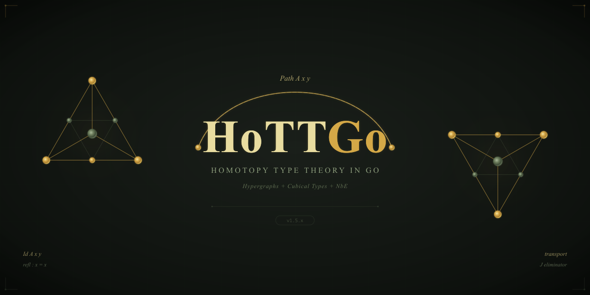

# HoTTGo

<p align="center">
  
</p>

<p align="center">
  <strong>Homotopy Type Theory in Go</strong>
</p>

<p align="center">
  <a href="https://github.com/watchthelight/HypergraphGo/releases"></a>
  <a href="https://github.com/watchthelight/HypergraphGo/actions/workflows/ci-linux.yml"></a>
  <a href="https://github.com/watchthelight/HypergraphGo/actions/workflows/ci-windows.yml"></a>
  <a href="https://github.com/watchthelight/HypergraphGo/stargazers"></a>
  <a href="https://github.com/watchthelight/HypergraphGo/blob/main/LICENSE.md"></a>
</p>

---

## What Is This?

HoTTGo is a cubical type theory kernel written in Go: around 17K lines you
can sit down and read, with computational univalence, higher inductive
types, and bidirectional type checking. It is a kernel rather than a proof
assistant. Parsing, elaboration, and tactics live outside the trusted core,
and everything that crosses the kernel boundary gets re-checked.

The `hottgo` binary is the main tool. It type checks core terms, evaluates
them, verifies proof scripts, and provides an interactive REPL with
tactics. Universe levels form a predicative, non-cumulative tower: a
`Type0` inhabitant is not silently accepted at `Type1`, and lifting is
explicit.

The project grew out of a hypergraph theory library, and that library still
ships as a secondary component: generic hypergraphs, transforms, and
algorithms behind the `hg` CLI. The repository and Go module keep the
historical name `HypergraphGo` so existing imports and package identifiers
stay valid.

---

## Where To Start

| Goal | First step |
|------|------------|
| Try the kernel | Install, then `hottgo -synth "Type"` (prints `Type : (Sort 1)`) |
| Verify proofs | `hottgo --load examples/proofs/hott/path_algebra.htt` (35 theorems) |
| Learn the CLI and tactics | [Getting Started with HoTTGo](getting-started-hottgo.md) |
| Embed the Go packages | `go get github.com/watchthelight/HypergraphGo`, then import `kernel/check` |
| Work with hypergraphs | `hg repl`, or import the `hypergraph` package |

---

## Installation

```bash
go get github.com/watchthelight/HypergraphGo
```

Prebuilt binaries and package-manager installs (Homebrew, Scoop,
Chocolatey, APT, AUR, Docker) are listed in the
[README installation section](https://github.com/watchthelight/HypergraphGo#installation).

---

## Current Status

All ten development phases are complete. The example suite holds 374
verified theorems across 20 proof files.

| Phase | Status | Description |
|-------|--------|-------------|
| Phase 0-4 | Done | Syntax, NbE, type checking, Id types, paths |
| Phase 5 | Done | Inductives, recursors, positivity (parameterized, indexed, mutual) |
| Phase 6 | Done | Computational univalence (Glue, comp, ua) |
| Phase 7 | Done | Higher Inductive Types (S¹, Trunc, Susp, Int, Quotients) |
| Phase 8 | Done | Elaboration: implicit arguments, holes, unification |
| Phase 9 | Done | Standard library and proof mode |
| Phase 10 | Done | Usability: REPL, proof scripts, diagnostics |

See the [ROADMAP](https://github.com/watchthelight/HypergraphGo/blob/main/ROADMAP.md)
for what each phase contains and what comes next.

---

## Quick Links

| Resource | Description |
|----------|-------------|
| [GitHub](https://github.com/watchthelight/HypergraphGo) | Source code |
| [Getting Started](getting-started-hottgo.md) | Install, REPL, first proof |
| [Architecture](architecture.md) | Kernel design overview |
| [DESIGN.md](https://github.com/watchthelight/HypergraphGo/blob/main/DESIGN.md) | Design decisions |
| [DIAGRAMS.md](https://github.com/watchthelight/HypergraphGo/blob/main/DIAGRAMS.md) | Mermaid architecture diagrams |
| [CHANGELOG.md](https://github.com/watchthelight/HypergraphGo/blob/main/CHANGELOG.md) | Version history |

---

## License

MIT License (c) 2025-2026 [watchthelight](https://github.com/watchthelight)
